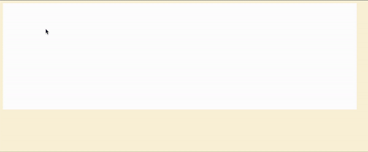

# 가속도계 구현

* 가속도계 이해, OOP를 곁들인

# 배운 것

* canvas 기본
* canvas 위에 처음 공 만들고 반사시키고, trace 남기기

# 공부

* canvas 전체 복습
* 마우스 이벤트로 클릭시 공 만들기
* 마우스 드래그 길이에 비례하게 속력 만들기 (약간 아쉽다)

# 질문

* Q. mac os 에서 화면 전환시 브라우저 더 빨라지는 이유?
  * => requestAnimationFrame이 주사율 60hz 보장하진 않는다. background에서 제대로 작동하지 않느다.
